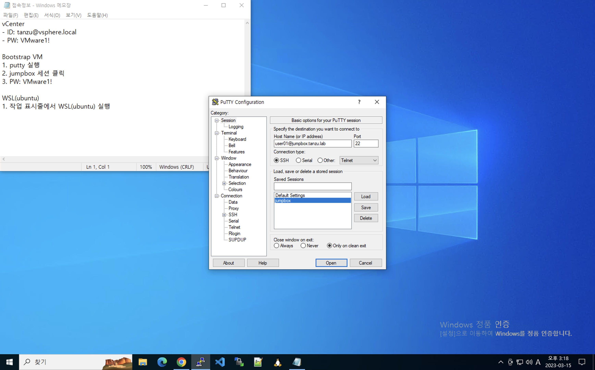
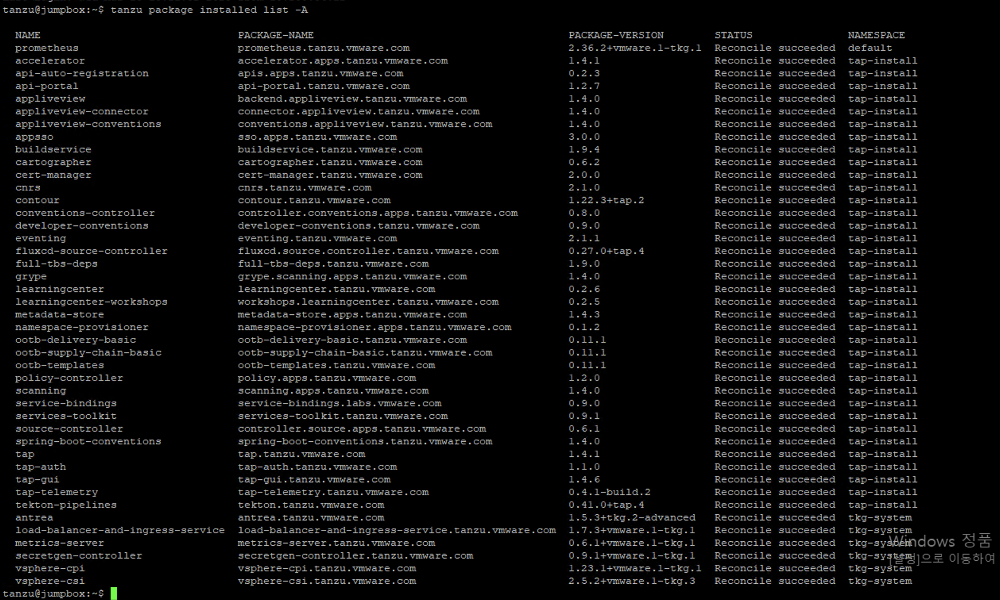
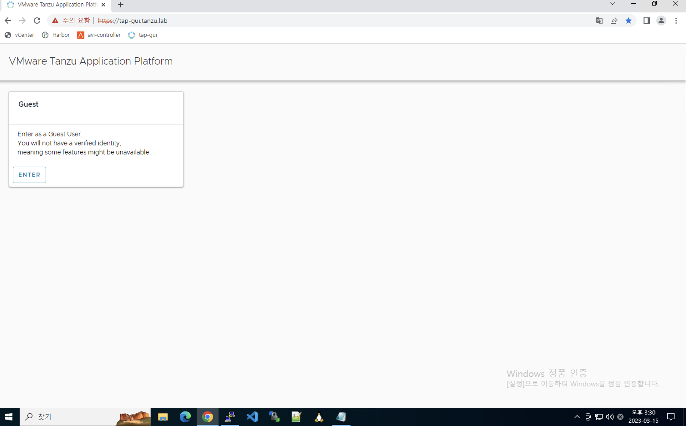
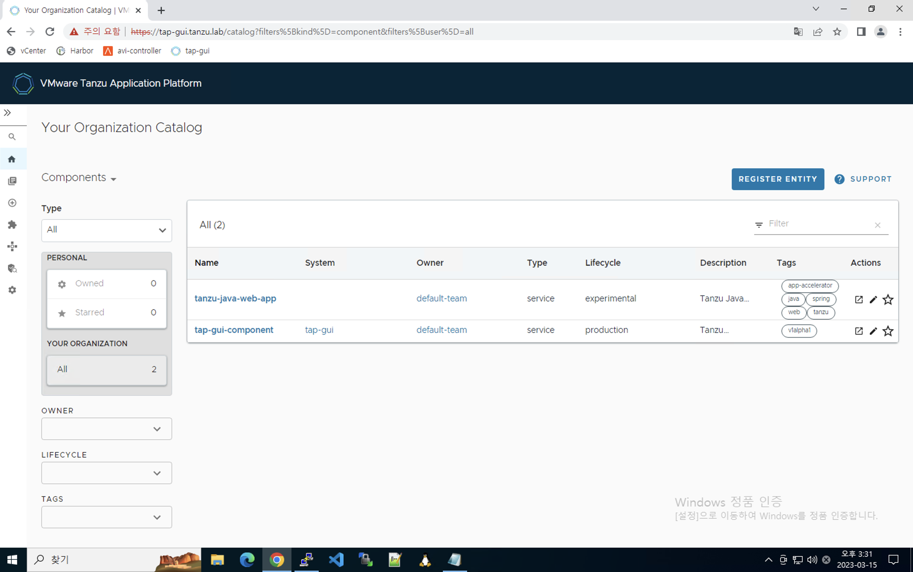

# Tanzu Application Platform (TAP) 인터넷 차단 환경 구성
본 가이드는 다음과 같은 환경을 기준으로 합니다.
- vSphere
- TKG 1.6.1
- TAP 1.4.1
- 앱 빌드를 위한 Maven Repository 별도 구성하지 않음 (인터넷 연결 가능하다고 가정)
- 소스 저장소: GitHub

 

## 0. 환경 정보 확인
### 0. 접속정보
Microsoft Remote Desktop에 접속합니다. 바탕화면의 접속정보.txt 파일을 클릭하면 HOL 환경에 접근하는 방법을 확인할 수 있습니다.    

### 1. Jumpbox 접속
Tanzu Kubernetes Grid 및 Tanzu Application Platform을 사용하기 위해서는 Jumpbox VM이 필요합니다.    
바탕화면의 Putty를 클릭해, Saved Session에서 Jumpbox를 클릭해 접속합니다.   
로그인 창이 나오면 비밀번호 (VMware1!) 를 입력합니다.   
  

### 2. TAP 설치 확인
Tanzu Application Platform에서 Tanzu CLI를 사용해 TAP가 성공적으로 설치되었는지를 확인합니다.   
~~~
tanzu package installed list -A
~~~
아래 캡쳐와 같이 namespace에 설치된 package들의 status가 Reconcile Succeed 이라면 다음 단계로 이동합니다.
  

해당 환경에서 tap-install은 TAP 구성요소 설치를 위한 네임스페이스이며, default는 기타 open source package, tkg-system은 TKG 구성요소 설치를 위한 네임스페이스입니다.   

### 3. TAP GUI 접속 확인
데스크탑에서 크롬을 클릭하면 상단 즐겨찾기에서 tap-gui 를 확인 가능합니다. 클릭하면 다음과 같은 화면으로 접속됩니다.    
  

Enter를 클릭하면 TAP의 Main 화면으로 이동합니다.    
  

위와 같은 캡처가 나오면 TAP가 성공적으로 설치된 것입니다.   
 
본 단계를 성공적으로 마치셨습니다.
