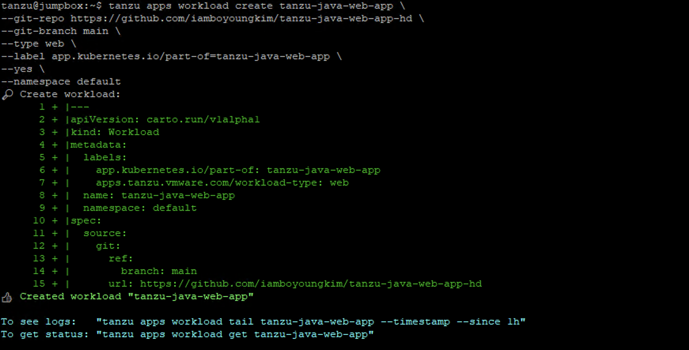
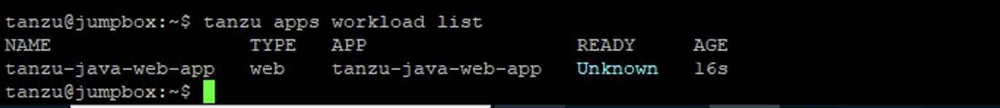
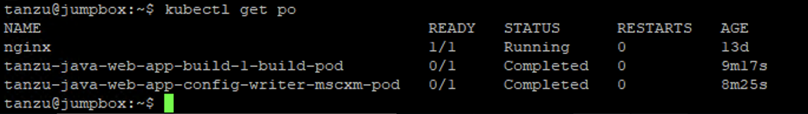
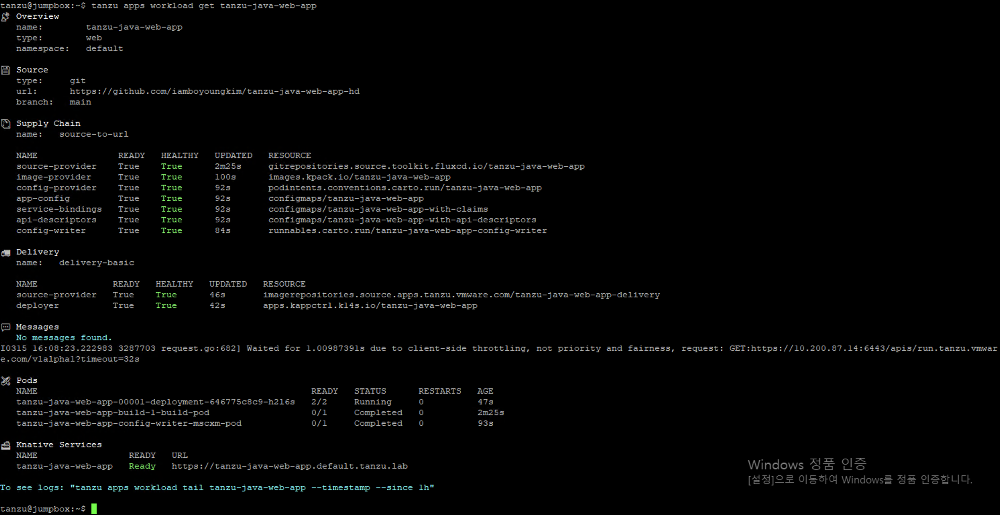
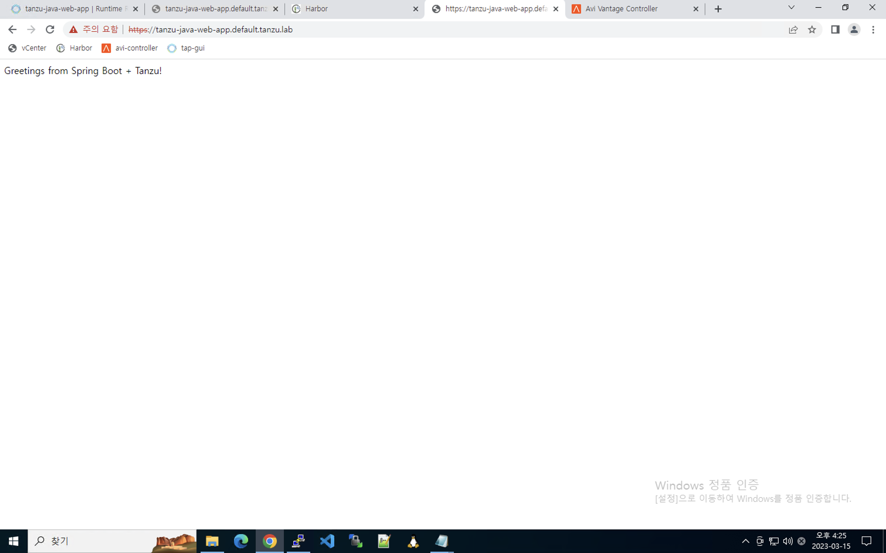
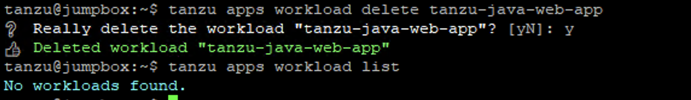
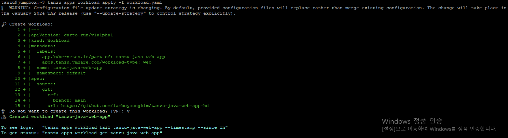

## TAP를 이용해서 APP 배포하고 TAP GUI에 워크로드 등록 및 조회합니다.

본 과정에서는 TAP (Tanzu Application Platform)를 이용하여 쉽게 애플리케이션을 배포하는 방법에 대해 학습합니다.

* Tanzu CLI 명령을 실행하여 앱을 배포합니다.
* 앱의 빌드 및 런타임 로그를 봅니다.
* 브라우저에서 배포된 앱을 확인합니다.
* tanzu-java-web-app accelerator를 본인의 로컬로 다운로드 합니다.
* 개인 Git 저장소에 업로드 합니다. 
* TAP GUI에서 app live view를 보기 위한 app을 배포합니다.


### 1.앱 배포
다음과 같이 2가지 방법으로 TAP를 이용하여 워크로드를 생성할 수 있습니다.
* tanzu CLI를 이용하여 생성
* workload 파일을 이용하여 생성

이번 랩에서는 tanzu CLI 파일을 작성하여 워크로드를 생성하는 방법으로 랩을 진행합니다.
앱 소스는 아래 git에서 가져옵니다. (https://github.com/iamboyoungkim/tanzu-java-web-app-hd)
해당 git repo는 실습자분의 git repo가 아니며 앱배포를 손쉽게 테스트를 시작하기 위한 repo입니다.


<br/>
**주의 : namespace는 앞에서 워크로드 배포를 위한 개발자용 네임스페이스 구성시 설정했던 namespace로 사용합니다.** <br/>

```cmd
tanzu apps workload create tanzu-java-web-app \
--git-repo https://github.com/iamboyoungkim/tanzu-java-web-app-hd \
--git-branch main \
--type web \
--label app.kubernetes.io/part-of=tanzu-java-web-app \
--yes \
--namespace default
```



위 사진과 같이 workload가 생성됩니다. 아래 log 보기 명령어와 status 보기 명령어를 참고해 배포 상태를 조회합니다.


### 2. 로그 확인
이제 워크로드가 잘 생성되고 있는지 다음 명령어를 이용해서 확인해 봅니다.
<br/>
> 워크로드 목록 조회
```cmd
tanzu apps workload list
```




TAP에서 수행되는 모든 행위들은 pod 기반으로 작동됩니다. git에서 참조하는 애플리케이션 소스를 기반으로 빌드를 수행해 주는 pod가 실행되고 있음을 알 수 있습니다.
```cmd
kubectl get pod
```
다음과 같이 pod를 확인 가능합니다.


처음 빌드할 경우, 빌드 pod 안에서 구동되는 여러 컨테이너들이 순차적으로 작업을 수행하게 되고, 이 작업이 완료되기까지 약 5~10분 정도 소요될 수 있습니다.

> 방금 생성한 "tanzu-java-web-app" 로그 조회
```cmd
tanzu apps workload tail tanzu-java-web-app --timestamp --since 1h
```

실시간으로 출력되는 로그를 확인할 수 있습니다.    


로그가 끝나면, tanzu apps workload get 명령어를 통해 조회합니다.
~~~
tanzu apps workload get tanzu-java-web-app
~~~



하단에서 배포된 app에 대한 URL을 확인할 수 있습니다.


로컬 PC에서 앱 호출을 확인하기 위해 /etc/hosts에 아래와 같이 추가하겠습니다.    
위치는 (C:)#Windows#System32#drivers#etc 아래의 host 파일입니다.    

```cmd
10.200.86.13 tanzu-java-web-app.default.tanzu.lab
```

이제 앱을 호출해 보도록 하겠습니다.

URL: https://tanzu-java-web-app.default.tanzu.lab

웹페이지는 아래와 같이 나타나게 됩니다.




### 3. 워크로드 삭제   
> 워크로드 삭제
```cmd
tanzu apps workload delete tanzu-java-web-app
```




> 기타 Tanzu CLI 참조

https://docs.vmware.com/en/VMware-Tanzu-Application-Platform/1.4/tap/cli-plugins-tanzu-cli.html


### 4. 워크로드 파일 생성 및 앱 배포
앞선 실습에서는 tanzu CLI를 이용하여 앱 배포를 하였고, 이번 실습에서는 workload 파일을 이용하여 앱을 배포하겠습니다.


여기서는 workload 파일을 작성하여 워크로드를 생성하는 방법으로 랩을 진행합니다.
앱 소스는 git에서 가져온다고 가정하고, 다음과 같이 workload.yaml 파일을 생성합니다.

```yaml
apiVersion: carto.run/v1alpha1
kind: Workload
metadata:
  name: tanzu-java-web-app
  labels:
    app.kubernetes.io/part-of: tanzu-java-web-app
    apps.tanzu.vmware.com/workload-type: web

spec:
  source:
    git:
      url: https://github.com/iamboyoungkim/tanzu-java-web-app-hd
      ref:
        branch: main
```

워크로드 파일을 생성한 후 tanzu 명령어로 워크로드를 생성합니다.
```cmd
tanzu apps workload apply -f workload.yaml
```

"y" 를 입력하고 계속해서 워크로드 생성을 진행합니다.


CLI 과정과 동일하게, 로그를 조회하고 배포되면 URL을 통해 최종 확인합니다.   

본 단계를 성공적으로 마무리 하셨습니다.   

