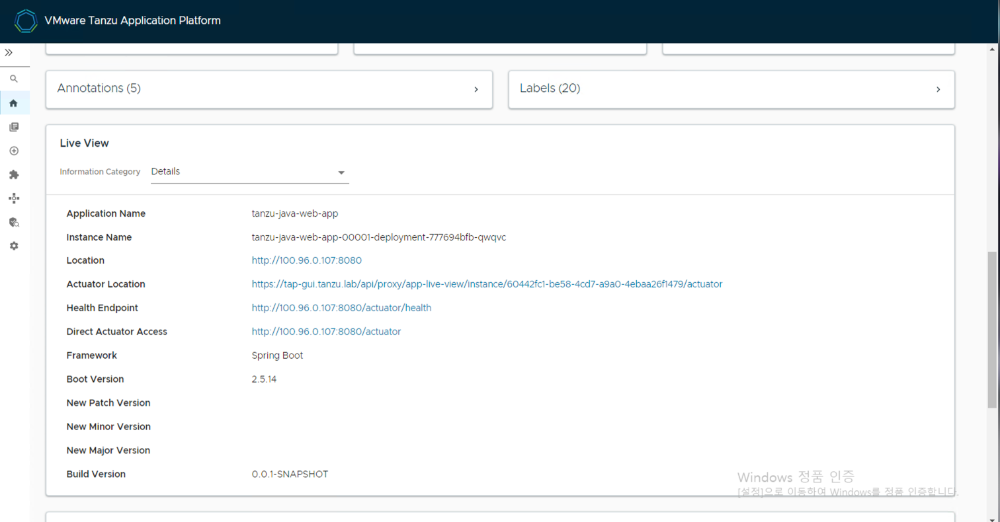
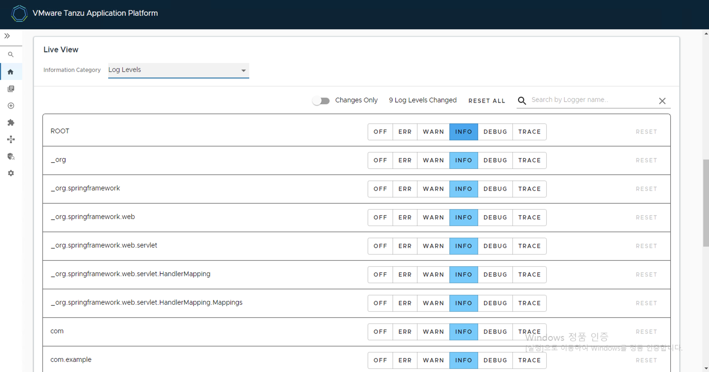
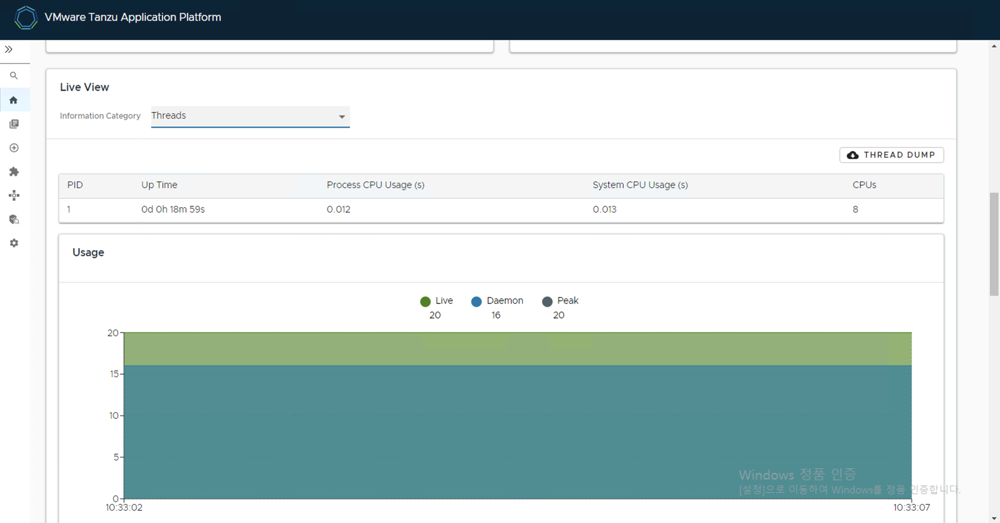
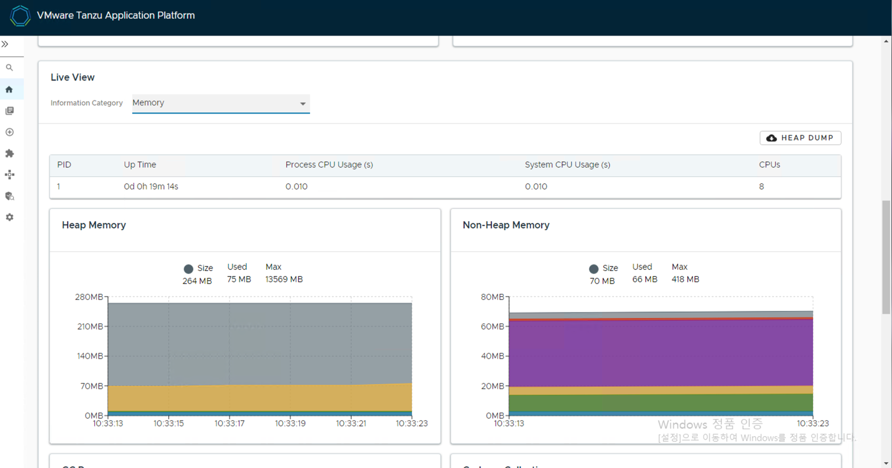
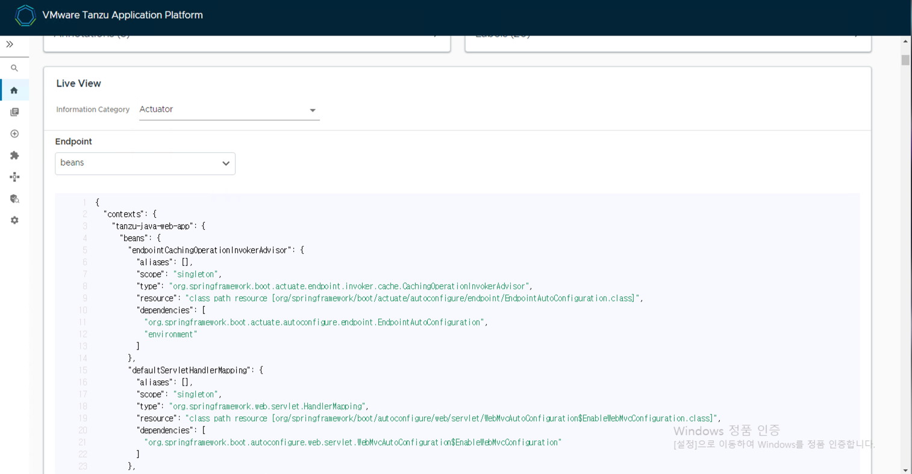

## Application Live View 둘러보기

본 과정에서는 TAP GUI에 포함된 Application Live View를 이용해 모니터링 하는 방법을 학습합니다.

### 1. 애플리케이션 사전 체크 사항
Application Live View는 Spring Boot 기반의 앱에서 Actuator 모듈을 추가했는지 확인합니다.

pom.xml 파일에 다음 artifact가 추가되었는지 확인합니다.

```xml
<dependency>
  <groupId>org.springframework.boot</groupId>
  <artifactId>spring-boot-starter-actuator</artifactId>
</dependency>
```

### 2. Spring Boot용 Application Live View
이 항목에서는 Spring Boot 앱에 대한 Application Live View 페이지에 대해 설명합니다.

#### 1) Application Live View 접속

Application Live View에 접속하는 순서는 다음과 같습니다.
- TAP GUI 내의 Organization Catalog 메뉴에서 카탈로그 선택
- "Runtime Resources" 탭 선택
- Kind에서 "Pod"를 체크하고 조회할 Pod 선택 
- Live View 섹션에서 Actuator 엔드포인트를 선택하여 모니터링 및 간단한 트러블슈팅 정보 확인

#### 2) Application Live View 둘러보기

- [간단한 Application Live View 설명](./gui.md#2-application-live-view)
- 자세한 사항은 [VMware 영문 매뉴얼](https://docs.vmware.com/en/VMware-Tanzu-Application-Platform/1.4/tap/tap-gui-plugins-app-live-view-springboot.html)을 참고하시기 바랍니다.

#### 3) Details page
라이브 뷰 섹션에 로드되는 기본 페이지입니다. 이 페이지는 다음 정보가 포함된 표 형식의 개요를 제공합니다.    

- application name
- instance ID
- location
- actuator location
- health endpoint
- direct actuator access
- framework
- version
- new patch version
- new major version
- build version

사용자는 페이지 오른쪽 상단 모서리에 있는 드롭다운 메뉴에서 선택하여 정보 카테고리를 탐색할 수 있습니다. 




#### 4) Log Level page
log level 페이지는 애플리케이션의 log 및 해당 구성에 대한 액세스를 제공합니다.    
사용자는 UI에서 실시간으로 INFO, DEBUG, TRACE 등의 로그 수준을 설정할 수 있습니다. 또한 패키지를 검색하고 해당 로그 수준을 편집할 수 있으며, 특정 클래스 및 패키지에서 로그 수준을 구성할 수 있습니다. 




#### 5) Thread page
이 페이지에는 애플리케이션의 JVM thread 및 실행 중인 process와 관련된 모든 세부 정보가 표시됩니다. 라이브 thread, 데몬 thread를 실시간으로 추적합니다.
<br/>
검색 기능을 통해 사용자는 스레드 ID 또는 상태별로 스레드를 검색할 수 있습니다. 새로고침 아이콘은 스레드의 최신 상태로 새로고침됩니다. 사용자는 스레드 ID를 클릭하여 더 많은 스레드 세부 정보를 볼 수 있습니다. 이 페이지에는 분석 목적으로 스레드 덤프를 다운로드하는 기능도 있습니다.    




#### 6) Memory page
메모리 페이지는 JVM 내부의 메모리 사용을 강조 표시합니다. heap 및 non-heap 메모리 내의 다양한 메모리 영역을 그래픽으로 표시합니다. 이는 JVM 내부의 데이터를 시각화하고 (JVM에서 실행되는 Spring Boot 앱의 경우) Kubernetes pod level에 대한 "외부" 정보와 달리 애플리케이션에 대한 메모리 통찰력을 제공합니다.   
<br/>
실시간 그래프는 사용된 총 메모리 및 총 메모리 크기와 함께 메모리의 다양한 공간에 대한 누적 개요를 표시합니다. 페이지에는 GC 일시 중지 및 GC 이벤트를 표시하는 그래프가 포함되어 있습니다.   
오른쪽 상단 모서리에 있는 heap 덤프를 사용하면 사용자가 heap 덤프 데이터를 다운로드할 수 있습니다.  




#### 7) Actuator page
Actuator 페이지는 actuator 데이터의 트리 보기를 제공합니다. 


