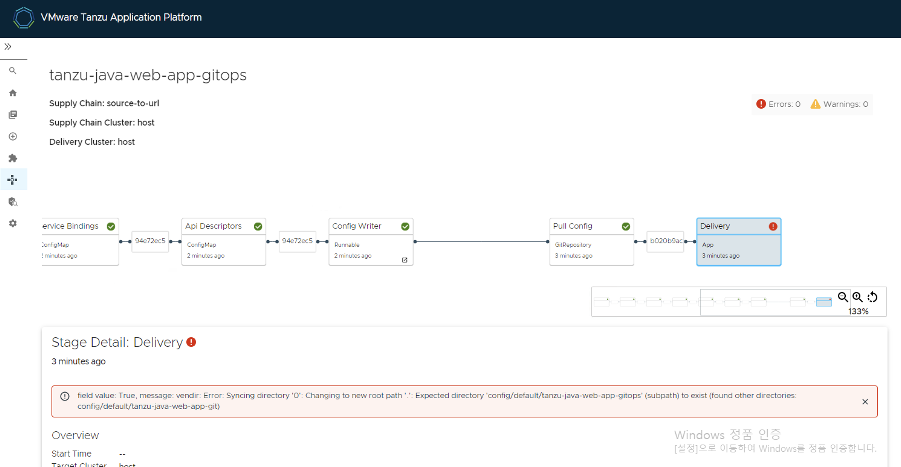
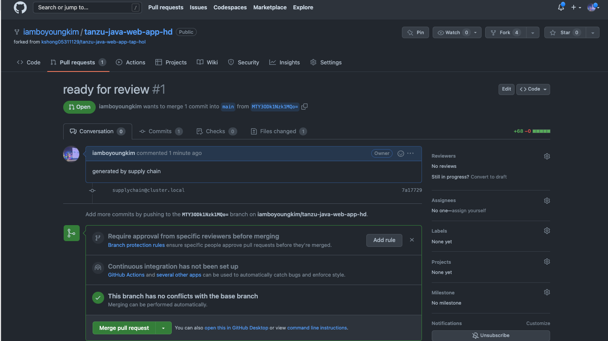
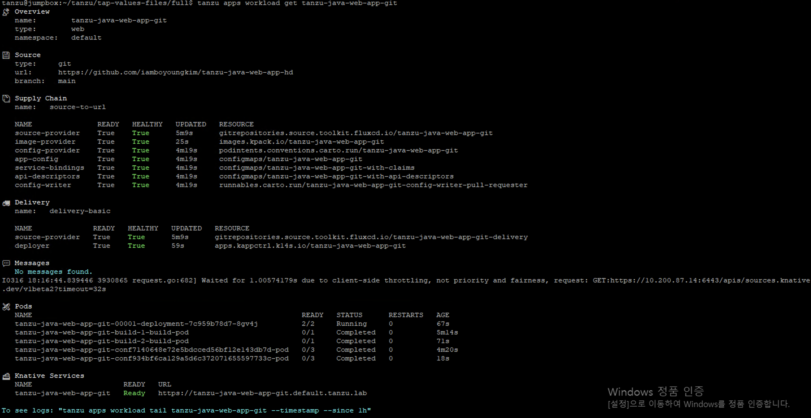

# GitOps

본 과정에서는 GitOps 접근 방식을 사용하여 Kubernetes 구성을 원격 Git 저장소로 푸시하도록 Supply Chain을 설정합니다.
* [참고 링크](https://docs.vmware.com/en/VMware-Tanzu-Application-Platform/1.4/tap/scc-git-auth.html)

## 0. 사전 준비
Token 발급 및 Repository Clone    

## 1. GitOps 적용

### 1) HTTP(S) Basic-auth
구성 정보를 담을 repository가 https:// 또는 http:// 를 사용한다면, Kubernetes 시크릿은 다음과 같이 해당 repository에 대한 credential을 제공해야 합니다.  
다음 Yaml 파일 예시를 참고하여 작성합니다. GIT-USERNAME에는 본인의 github id, GITHUB-ACCESS-TOKEN에는 본인의 github token 정보를 사용합니다.  

~~~
apiVersion: v1
kind: Secret
metadata:
  name: git-secret
  annotations:
    tekton.dev/git-0: https://github.com
type: kubernetes.io/basic-auth
stringData:
  username: GITHUB-USER-NAME
  password: GITHUB-ACCESS-TOKEN
~~~

작성 완료 후 해당 파일을 적용합니다.

~~~
kubectl apply -f gitops-http-auth.yaml
~~~

### 2) ServiceAccount 작성
secret 생성 이후에는 workload에서 사용하는 serviceaccount와 붙이는 과정이 필요합니다. 다음 yaml 파일을 적용합니다.
~~~
apiVersion: v1
kind: ServiceAccount
metadata:
  name: default
secrets:
  - name: registry-credentials
  - name: tap-registry
  - name: git-secret
imagePullSecrets:
  - name: registry-credentials
  - name: tap-registry
~~~

### 3) tap-values.yaml 파일 수정
tap-values.yaml의 ootb_supply_chain 항목을 다음과 같이 수정합니다. (supply chain은 다시 basic으로 수정합니다)  
GIT-USERNAME에는 본인의 github 계정 정보를 입력하며, 이때 본인의 계정 아래에 tanzu-java-web-app-hd 라는 Repository가 있는지 확인하고 진행합니다.
~~~/su/
supply_chain: basic

ootb_supply_chain_basic:
   gitops:
     server_address: https://github.com/
     repository_owner: GIT-USERNAME
     repository_name: tanzu-java-web-app-hd
     branch: main
     ssh_secret: git-secret
     commit_strategy: pull_request
     pull_request:
       server_kind: github
       commit_branch: ""
       pull_request_title: ready for review
       pull_request_body: generated by supply chain
 ~~~
다음으로 수정된 profile을 업데이트합니다.

~~~
tanzu package installed update tap -p tap.tanzu.vmware.com -v 1.4.1 --values-file tap-values.yaml -n tap-install
~~~

### 4) 애플리케이션 배포
다음을 실행하여 애플리케이션을 배포합니다
~~~
tanzu apps workload create tanzu-java-web-app-git \
--git-repo https://github.com/iamboyoungkim/tanzu-java-web-app-hd \
--git-branch main \
--type web \
--label app.kubernetes.io/part-of=tanzu-java-web-app \
--annotation autoscaling.knative.dev/minScale=1 \
--yes \
--namespace default
~~~

## 2. GitOps 적용된 내용 GUI에서 확인
### 1) GUI의 Supply Chain 화면 접속
workload 배포 후, TAP GUI의 Supply Chain으로 가면 Delivery 단계에서 빨간색 느낌표 표시를 확인할 수 있습니다.    
아직 approval 단계를 거치지 않았기 때문입니다.

### 2) PR 확인
Github 로 이동해, 해당 repository 에서 pull request를 확인하고, merge 합니다.  

위 사진과 같이 설정했던 리뷰 문구가 표시되고, commit 내용 및 변경된 파일 확인, comment 작성, merge 수행 등이 가능합니다.  
이 중 Merge 작업을 수행합니다.

## 3. 워크로드 재배포 과정 확인
Merge 이후 터미널로 돌아와 tanzu apps workload get 명령어로 조회하면 해당 Workload가 다시 배포되는 것을 확인할 수 있습니다. Build pod가 최근에 증가되었고, Knative Service 아래에 해당 app 접근 가능한 Url이 표시됩니다.   

소스코드의 변경이 있을때도 동일하게 approval 과정을 거쳐 build pod가 다시 생성되는 workload 재배포 과정을 거치게 됩니다.    
TAP GUI에서도 성공적으로 배포된 모습을 확인 가능합니다.   