## Tanzu Application Paltform GUI 알아보기
이번 실습에서는 Spring Boot 앱에서 개발자들에게 제공되는 Actuator를 기반으로 한 정보들을 TAP에서 효과적으로 보여줄 수 있는 방법과 
그리고 TAP GUI 화면들에서 대해서 알아보겠습니다.

### 1. TAP GUI 메뉴 둘러보기
TAP GUI의 메뉴들을 살펴보도록 하겠습니다.

#### Catalog
앞 세션에서 App를 배포하고 해당 App들이 등록된 화면입니다.

Catalog 목록중 "tanzu-java-web-app"을 클릭 해보겠습니다.
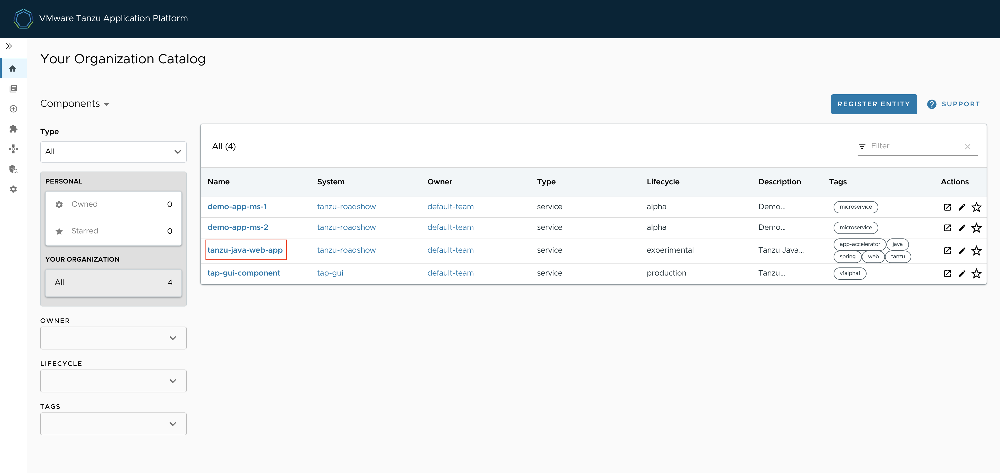

SYSTEM의 "tanzu-roadshow"을 클릭 해보겠습니다.
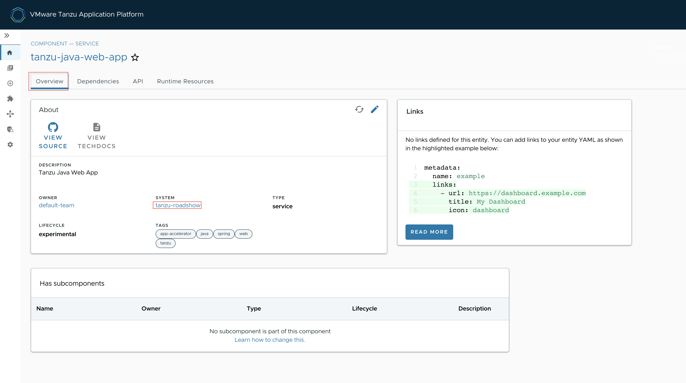

오른쪽에 Has components목록과 APIs 목록을 확인 할 수 있습니다.
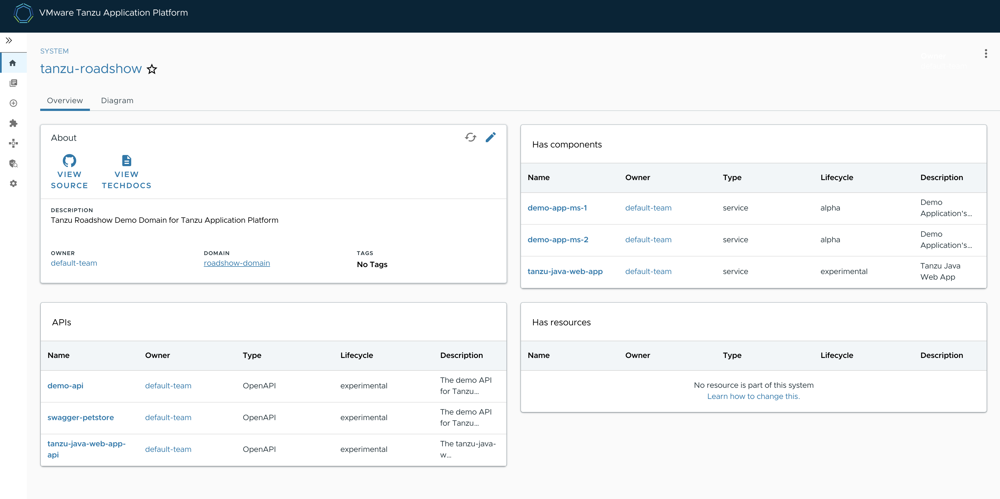

"Diagram" 클릭하겠습니다.
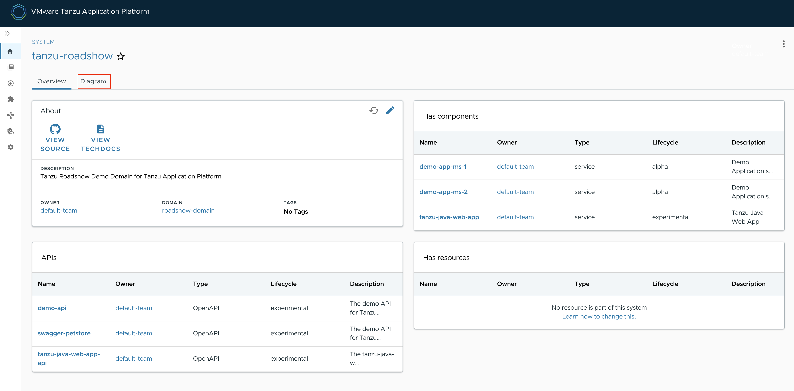

"Diagram" 확인 할 수 있습니다.
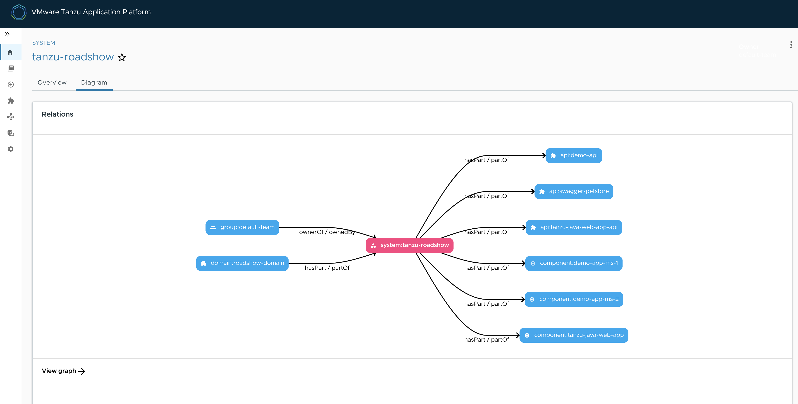

#### Documentation
배포한 APP들의 상세한 설명을 볼 수 있는 메뉴입니다.
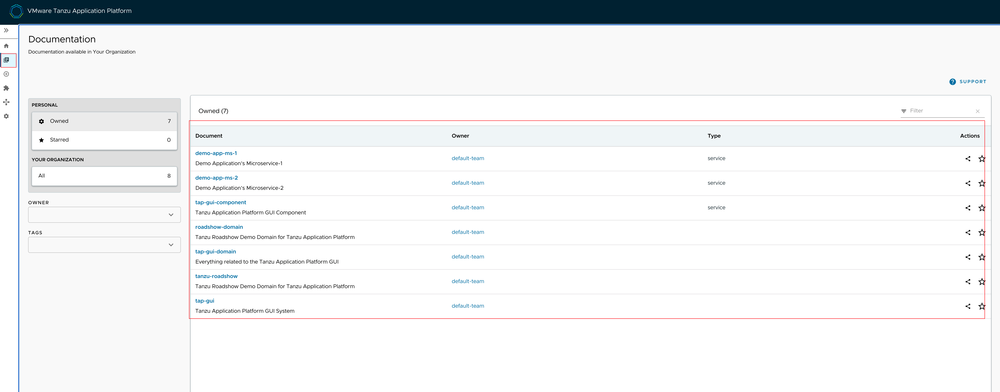

#### Accelerators
APP들을  Accelerators에 등록할수 있으며, 현재 등록된 App들을 보여주는 메뉴입니다. 
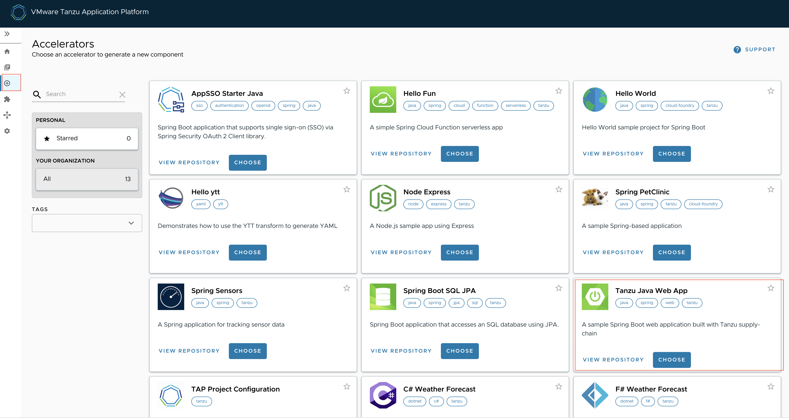

#### APIs
API 목록을 확인 할 수 있는 메뉴입니다.
"tanzu-java-web-app-api" 클릭합니다.
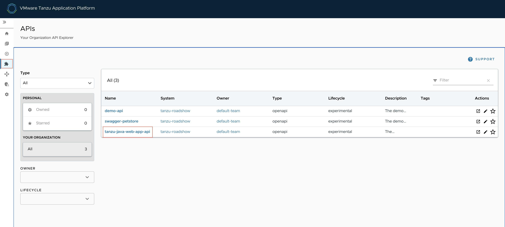

"Definition"을 클릭합니다.
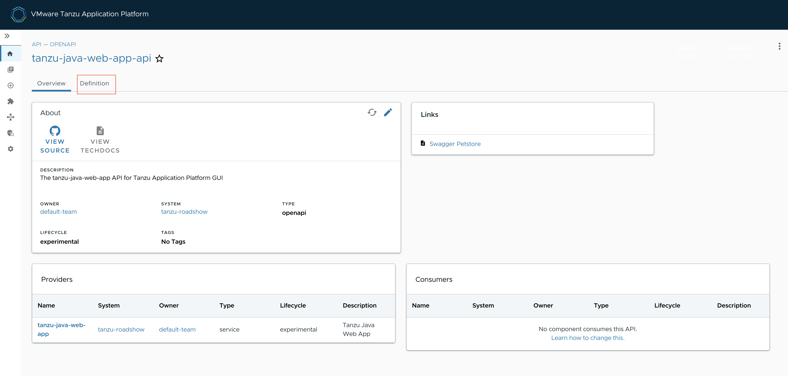

API 목록을 확인 할 수 있습니다.
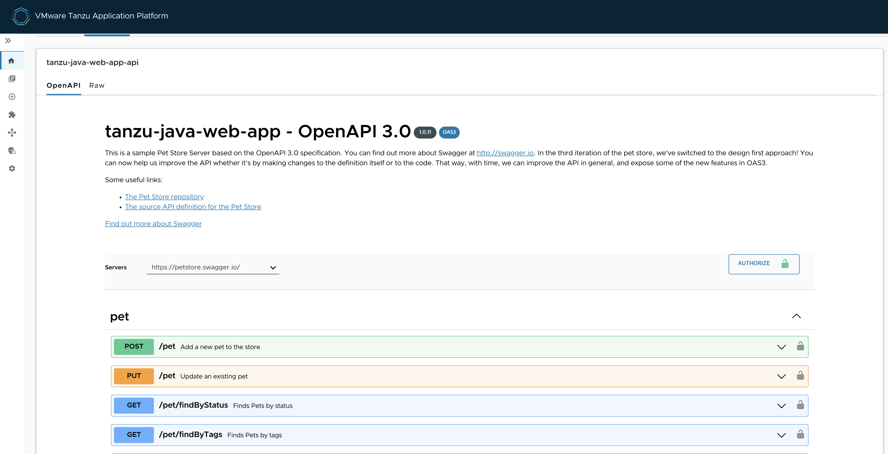

#### WORKLOADS
배포된 Workload 목록을 확인 할 수 있는 메뉴입니다.
"tanzu-java-web-app" 을 클릭합니다.
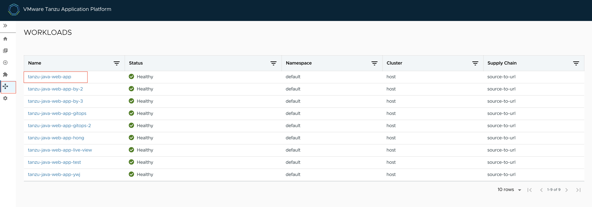

tanzu-java-web-app의 파이프라인  정보 및 단계별 상황을 확인 할 수 있습니다. 
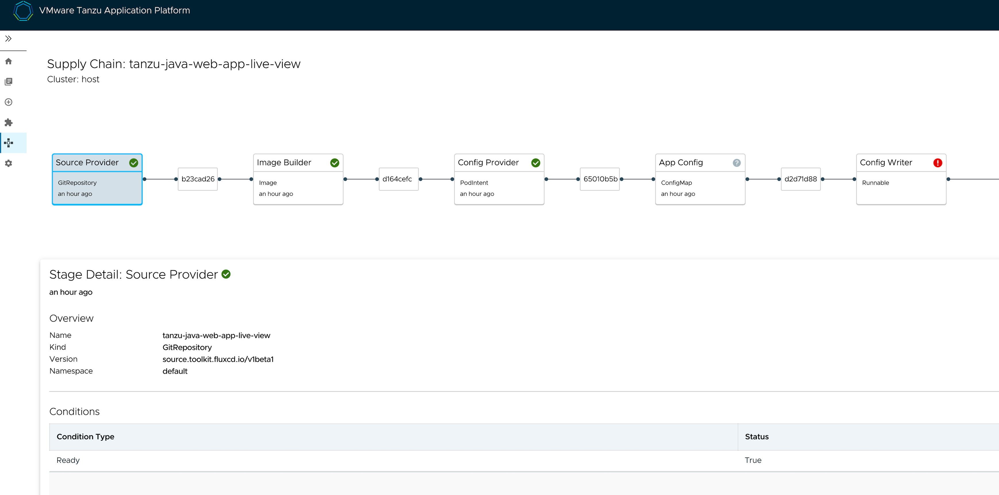

