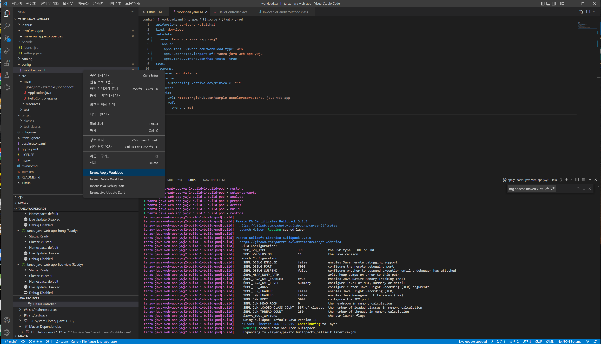
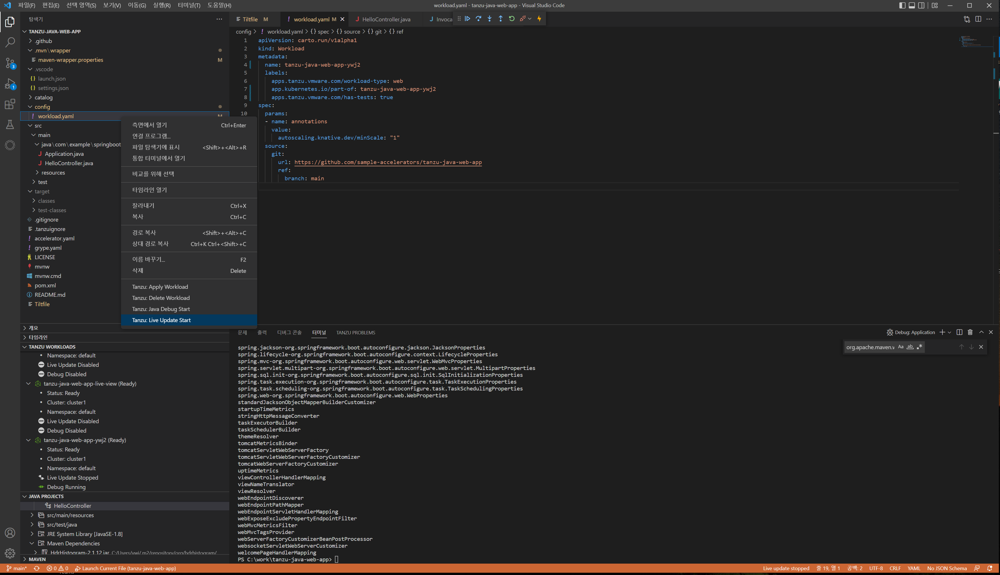
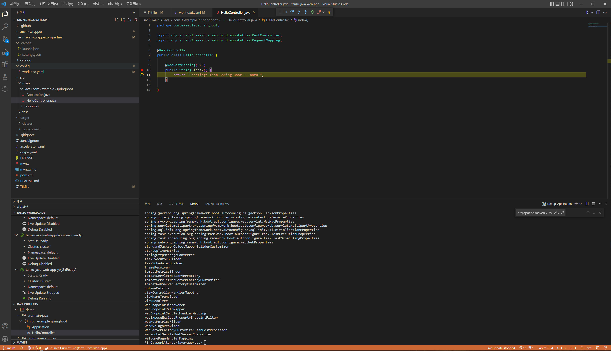
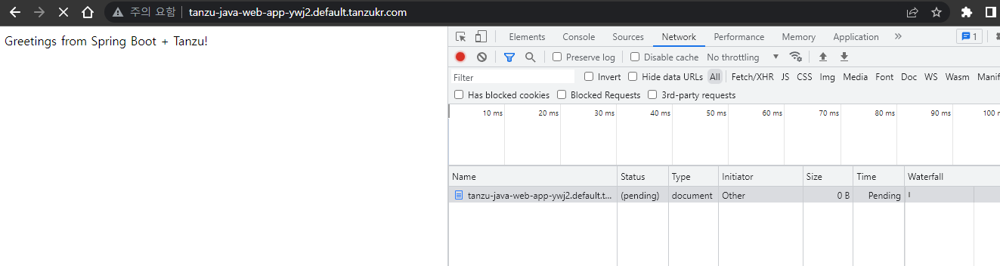

## 동적 배포와 원격 디버깅
여기서는 간단한 guide만 설명하고 있습니다. 자세한 내용은 아래의 주소에서 확인할 수 있습니다.

https://docs.vmware.com/en/VMware-Tanzu-Application-Platform/1.4/tap/getting-started-iterate-new-app.html


### 동적 배포와 원격 디버깅
1. 소스 download
    로컬 경로에 자신의 github.com 에 올려져 있는 tanzu-java-web-app을 git clone을 통해 소스를 다운로드 합니다.
    ```
    예:)    git clone https://github.com/iamboyoungkim/tanzu-java-web-app-hd
    ```
2. Visual Studio Code 에 '폴더 열기' 메뉴를 클릭하여 위에서 다운로드 받은 폴더를 엽니다.

3. workload 실행
    

4. Live Update

    Live Update 기능을 시작합니다.
        
    페이지가 정상적으로 열리는지 확인합니다.
    소스를 수정하고 변경사항이 바로 적용이 되는지 확인합니다. 10초 이내에 반영이 되어야 합니다.

3. Debug

    Debug기능을 이용하기 위해 먼저 마우스로 소스에 break point를 설정하고 Debug Start 를 시작합니다.
    

    
    다시 호출해서 workload가 Ready가 되면 페이지를 호출합니다. 페이지가 정상적으로 열리지 않고 pending상태가 되어 있는 것을 확인할 수 있습니다.
    
    VS Code에서 Resume기능이나 한 Step 이동하는 기능으로 Debug를 확인합니다.
    
    

