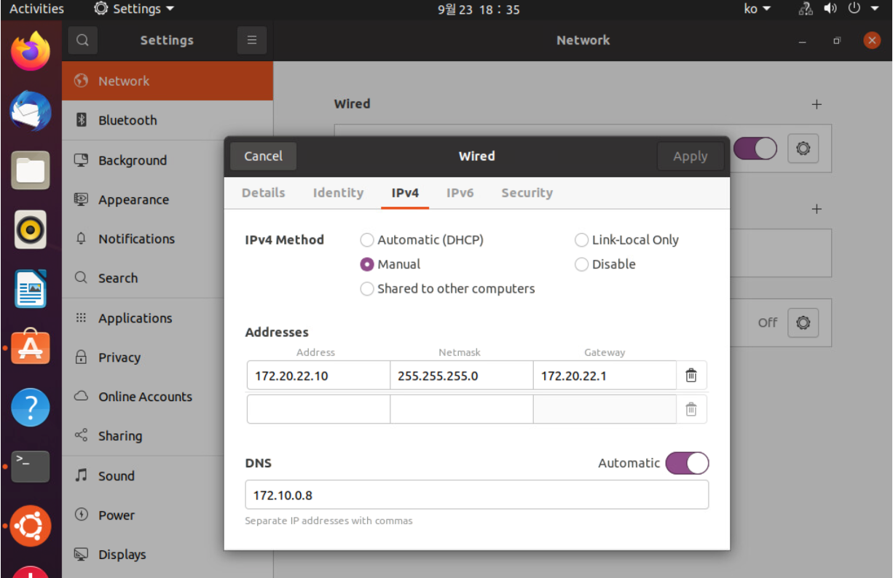

## Jumpbox 준비 및 TKG 설치하기

### 사전 준비사항
- DNS Server
- Avi Load Balancer
- [Jumpbox 다운로드](https://onevmw.sharepoint.com/:f:/r/teams/TAPHOLWorkshop/Shared%20Documents/General/jumpbox?csf=1&web=1&e=1Zi1TL)

### Jumpbox 준비
1. 다운로드 받은 jumpbox 파일읊 vCenter에서 'OVF 템플릿 배포'를 해서 업로드 합니다.
1. 업로드한 VM을 시작합니다.
1. jumpbox VM에 GUI 콘솔
1. jumpbox VM의 IP 변경
 
네트워크 설정으로 들어가서 IP와 DNS를 현재의 환경에 맞게 변경합니다.
DNS서버는 비워두고 Automatic으로 합니다. 네트워크를 비활성화 했다가 다시 활성화 합니다.
CLI로 변경할 경우에는 아래의 주소에 있는 파일을 변경합니다.
```
/etc/NetworkManager/system-connections/
sudo service network-manager restart
```

1. jumpbox에 접속
jumpbox에 있는 계정은 root와 tap 계정이고 비밀번호는 모두 VMware1! 입니다.
``` ssh root@10.220.58.99 ```

1. DHCP서버 수정
현재의 환경에 맞도록 dhcp range를 수정합니다.

```
subnet 172.20.22.0 netmask 255.255.255.0 {
  range 172.20.22.20 172.20.22.100;
  option domain-name-servers 172.10.0.8;
  option subnet-mask 255.255.255.0;
  option routers 172.20.22.1;
  option broadcast-address 172.20.22.255;
  default-lease-time 600;
  max-lease-time 7200;
}
```
1. DHCP 서버 재기동
```
systemctl restart isc-dhcp-server.service
systemctl status isc-dhcp-server.service
```
dhcp server가 active인 것을 확인합니다.

1. Harbor 기동
```
cd /tanzu/harbor
docker-compose up -d
```

기존에 운영 중인 DNS서버에 harbor.tanzukr.com를 등록 합니다.
윈도우 DNS서버가 없는 경우 다음의 방법으로 bind9으로 설치하셔도 됩니다.
[bind9 DNS 서버 설치](./dns-install.md)

### TKG 설치하기
1. TKG 설치 준비
```
su - tap
cd dns
vi vsphere-overlay.yaml
172.20.22.10   harbor.tanzukr.com 부분을 새로 할당한 jumpbox ip를 입력합니다.
cp vsphere-overlay.yaml /home/tap/.config/tanzu/tkg/providers/infrastructure-vsphere/ytt
vi tkr_overlay.lib.yaml
172.20.22.10   harbor.tanzukr.com 부분을 새로 할당한 jumpbox ip를 입력합니다.
cp tkr_overlay.lib.yaml ~/.config/tanzu/tkg/providers/ytt/03_customizations/01_tkr/tkr_overlay.lib.yaml
```

1. TKG BaseOS 이미지 다운로드
[TKG Download Page](https://customerconnect.vmware.com/en/downloads/details?downloadGroup=TKG-154&productId=988&rPId=93384)
TKG 1.5.4를 선택하고 Photon v3 Kubernetes v1.22.9 OVA 를 다운로드 합니다.

1. TKG BaseOS 이미지 vCenter에 업로드
Kubernetes v1.22.9+vmware.1-tkg.1 ovf 템플릿 파일을 다운로드 하여 vSphere에 업로드를 해 둡니다.
photon-3-kube-v1.22.9+vmware.1-tkg.1-06852a87cc9526f5368519a709525c68.ova

1. TKG Mgmt Cluster 생성
tap 계정으로 다음 명령어를 실행합니다.
```
tanzu mc create --ui -b 0.0.0.0:9090 
```

1. TKG 설치 UI 진행
TKG 설치 UI를 통해 TKG를 설치합니다. 
설치는 vSphere with Tanzu(TKGs) 가 아니고 TKGm으로 설치를 진행하셔야 합니다.
Deploy TKG Managment Cluster를 선택해서 설치를 진행합니다.

1. SSH public key 다운로드
설치시에 입력하는 SSH public key는 편의를 위해 jumpbox 의 tap 계정에 있는 ssh key(id_rsa.pub) 파일을 로컬 PC에 다운받아서 사용합니다.
Dev모드, 인스턴스 Type은 medium으로 설치합니다.
control plane endpoint주소는 dhcp주소와 겹치지 않도록 네트워크 범위에 있는 ip를 입력합니다.

1. LB가 필요하기 때문에 AVI와 설치시에 연동을 해도 됩니다. 이 Lab에서는 TKG 클러스터를 모두 설치한 후에 연동하는 방식으로 진행합니다.

Management-Cluster가 정상적으로 설치되면 다음의 명령어로 kubeconfig를 얻습니다.
```
tanzu mc  kubeconfig get --admin
kubectl config use-context mgmt1-admin@mgmt1
```

1. TKG Workload Cluster 생성
TAP는 TKG Workload Cluster 위에 추가 패키지의 형태로 설치가 됩니다.
이제 TAP를 설치할 TKG Cluster를 하나 생성해보겠습니다.
```
cd ~/.config/tanzu/tkg/clusterconfigs 
```
로 이동해서 방금만든 yaml파일을 복사해서 새로운 파일을 만듭니다.

```
tap@harbor:~/.config/tanzu/tkg/clusterconfigs$ cp vdwmd173jo.yaml cluster1.yaml
tap@harbor:~/.config/tanzu/tkg/clusterconfigs$ vi cluster1.yaml
CLUSTER_NAME와 VSPHERE_CONTROL_PLANE_ENDPOINT 를 적절히 변경합니다.

tap@harbor:~/.config/tanzu/tkg/clusterconfigs$ tanzu cluster create --file cluster1.yaml -v 9
```