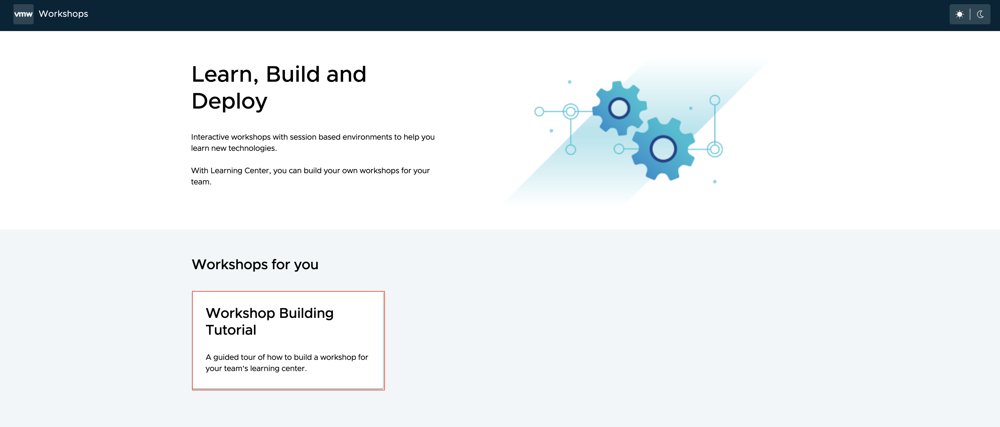
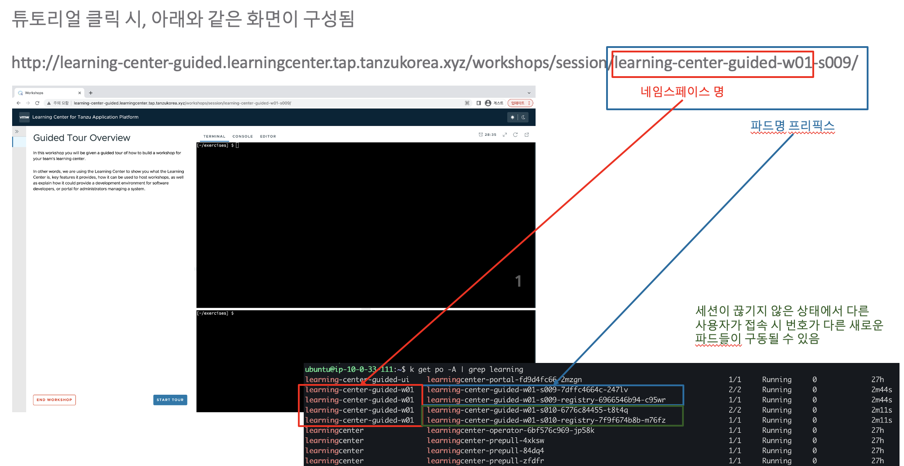
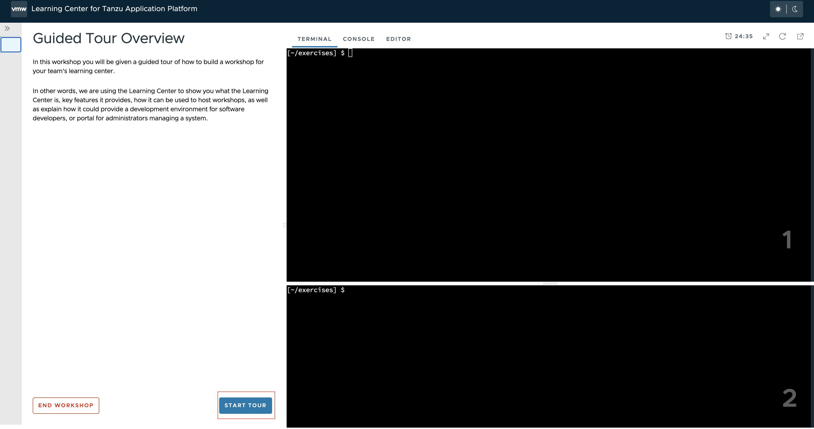

## TAP를 이용해서 APP 배포하고 TAP GUI에 워크로드 등록 및 조회합니다.

본 과정에서는 Learning Center에 대해서 알아보고
Learning Center는 워크샵을 만들고 자체 호스팅할 수 있는 플랫폼을 제공합니다. 이를 통해 콘텐츠 제작자는 지시 마법사 UI를 사용하여 
터미널 셸 환경에서 학습자에게 표시되는 마크다운 파일로부터 워크샵을 만들 수 있습니다. UI는 슬라이드 콘텐츠, 통합 개발 환경(IDE), 쿠버네티스 클러스터에 액세스하기 위한 웹 콘솔 및 기타 사용자 지정 웹 응용 프로그램을 포함할 수 있습니다.
Learning Center를 실행하려면 Kubernetes가 필요하며 사용자에게 Kubernetes에 대해 가르치는 데 사용되지만 다른 목적으로도 교육을 호스팅하는 데 사용할 수 있습니다.


 Learning Center에서는 전체 운영 체제를 사용하는 전체 가상 시스템을 사용하는 대신 각 워크샵 세션이 Kubernetes 클러스터의 컨테이너가 됩니다
 모든 작업이 완료되고 워크샵 세션이 삭제되면 세션에 할당된 Kubernetes 네임스페이스와 같이 Kubernetes 클러스터에서 사용 중인 리소스가 자동으로 삭제됩니다.

### Learning Center 워크샵 실습해보기
Learning Center의 워크샵의 URL를 확인해보겠습니다.

`
```cmd
kubectl get ingress -A
```


도매인 설정이 되어 있지 않다면 로컬 PC의 /etc/hosts에 ADDRESS,HOSTS를 추가합니다.


위에서 확인된 URL로 Learning Center에 접속합니다.

URL: http://learning-center-guided.learningcenter.tap.tanzukorea.xyz


"WorkShop Building Tutorial" 버튼을 클릭합니다.



Learning Center의 워크샵은 세션마다 pod로 구동이 되며 관리가 되고 종료했을시 pod도 삭제가 되어 종료하게 됩니다.


"Start Tour" 버튼을 클릭하여 해당 워크샵을 시작합니다.
워크샵 환경과 상호 작용하기 위한 워크샵 지침 세트는 좌측에 표시되고, 터미널은 우측에 하나 이상 표시됩니다.



해당 워크샵에서는 왼쪽의 네모박스된 부분을 순차적으로 클릭하면 오른쪽 terminal창에 자동으로 스크립팅되어 실행됩니다.
이로 인한 이점은 사용자가 실수를 최대한 줄이면서 워크샵을 진행할수 있습니다. 
모든 cmd가 실행이 완료되었으면, "CONTINUE" 버튼을 클릭하여 워크샵을 진행합니다.


모든 워크샵을 마지막까지 진행 한 후 아래와 같이 종료합니다.


